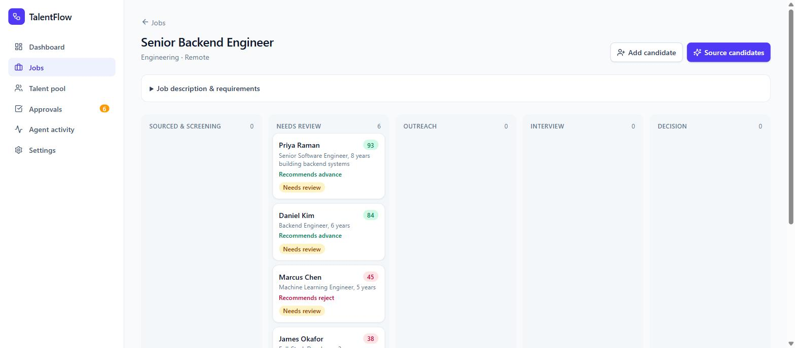
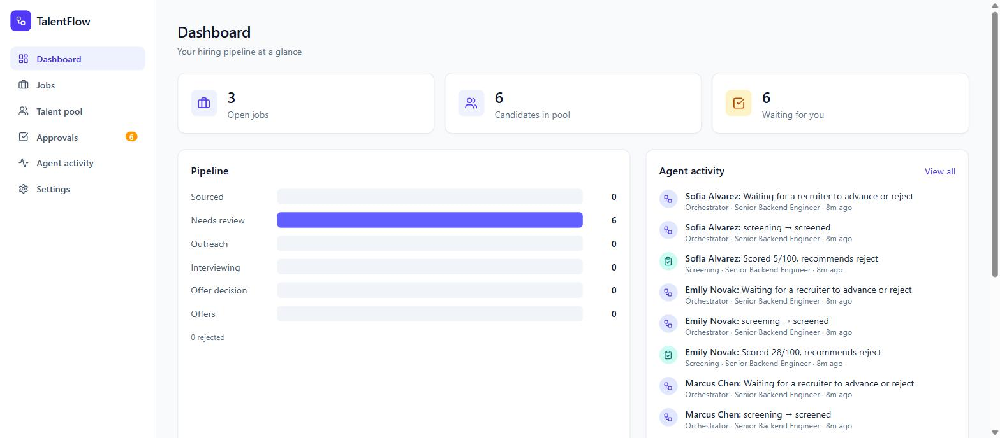
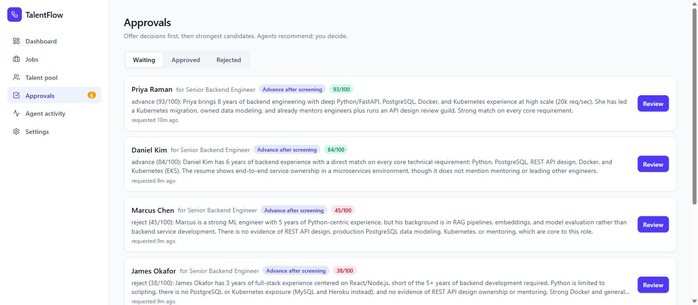
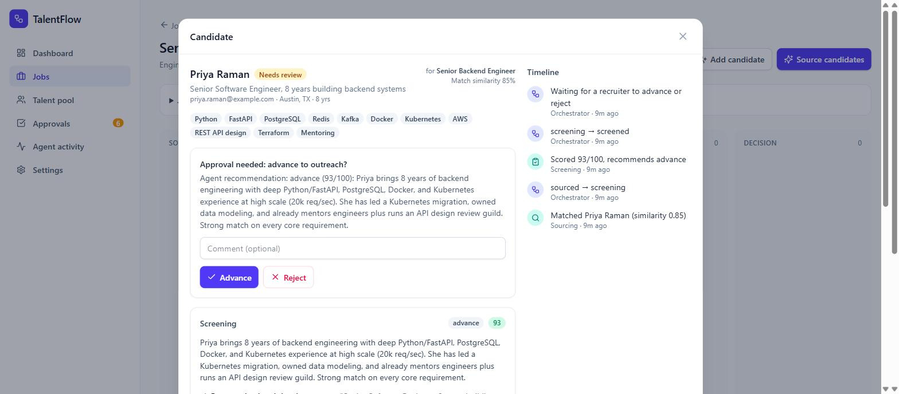
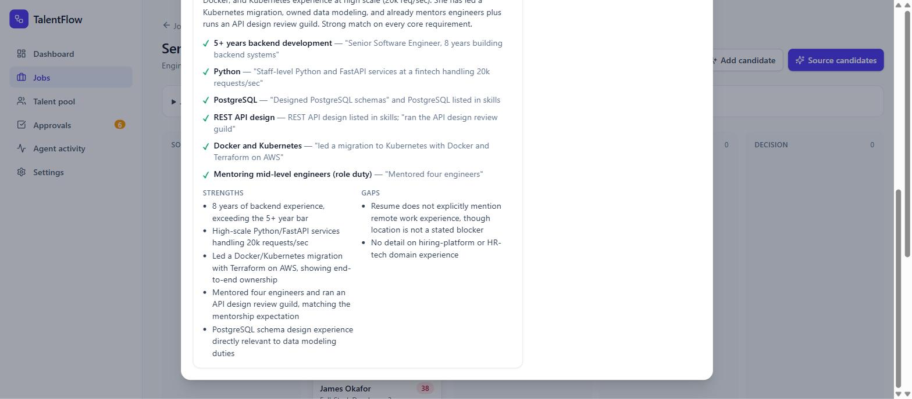
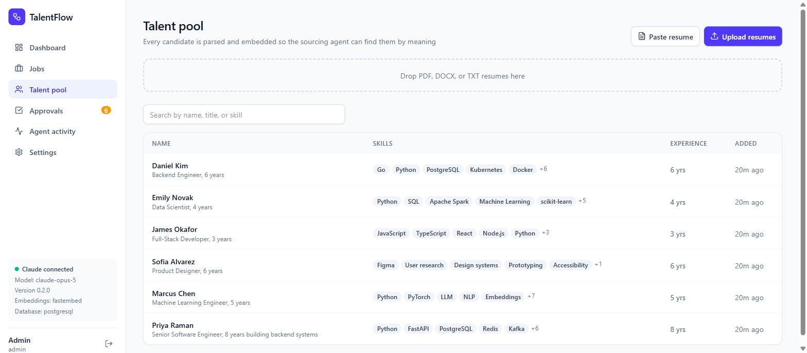
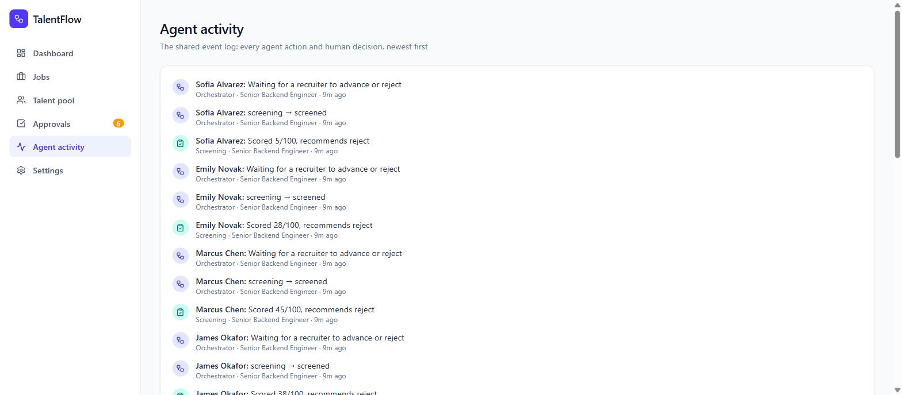
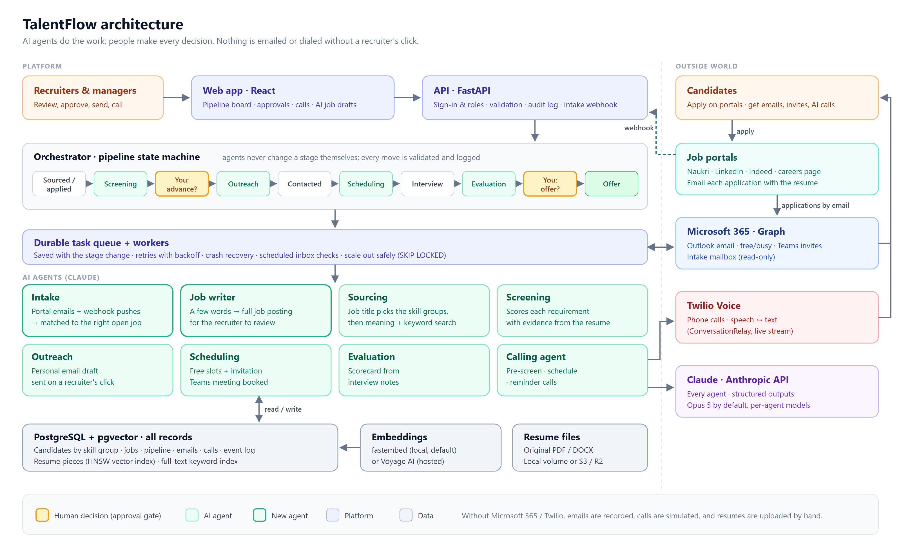

# TalentFlow

**An open-source, multi-agent recruiting pipeline powered by Claude.**

Five specialist AI agents source, screen, contact, schedule, and evaluate candidates. An orchestrator moves each candidate through the pipeline, and a person makes every decision that matters: nobody advances past screening or gets an offer without a human approving it.



**New here?** Read the **[user guide](docs/USER_GUIDE.md)** for how the platform works and how to use every screen.

## Screenshots

| | |
|---|---|
|  **Dashboard.** Pipeline at a glance and a live feed of agent activity. |  **Approvals.** The review queue, strongest candidates first. Agents recommend; you decide. |
|  **Candidate review.** The agent's recommendation, the approval gate, and the full timeline. |  **Evidence-based screening.** Every requirement checked, with a quote from the resume. |
|  **Talent pool.** Upload PDF, DOCX, or TXT resumes; Claude parses the skills and experience. |  **Audit trail.** Every agent action and human decision, with who made it. |

_All screenshots show demo data from `python -m app.seed`, screened by Claude Opus 5._

## Architecture



## Features

- **Semantic sourcing.** Resumes and jobs are embedded with pgvector, so "built RAG pipelines" matches a job asking for "LLM applications" even with zero shared keywords.
- **Evidence-based screening.** Each requirement is marked met, partial, or not met, with a quote from the resume. The agent is instructed to ignore protected characteristics.
- **Personalized outreach.** Emails reference what actually makes the candidate a fit.
- **Scheduling.** The agent proposes interview slots within working hours in your timezone and drafts the invitation.
- **Structured scorecards.** Interview notes become per-competency ratings, a hire recommendation, and risks to probe.
- **Human approval gates.** A person decides to advance or reject after screening, and to offer or reject after evaluation.
- **Full audit trail.** Every agent action and human decision is written to an append-only event log, with who made it.
- **Built for production.**
  - Sign-in with admin and recruiter roles.
  - A durable agent task queue with retries and crash recovery.
  - Alembic migrations, security headers, rate-limited login, and JSON logs.
  - One-command AWS deployment with HTTPS and nightly backups.
- **Runs anywhere.** One `docker compose up` runs everything. With no API key it runs in an offline demo mode.

## Quick start

### Docker (recommended)

```bash
git clone https://github.com/<you>/talentflow.git
cd talentflow
cp .env.example .env          # set ADMIN_EMAIL / ADMIN_PASSWORD, and ANTHROPIC_API_KEY (optional)
docker compose up --build
```

Open **http://localhost:8000** and sign in with the admin credentials from `.env`. To load demo jobs and candidates:

```bash
docker compose exec app python -m app.seed
```

### Local development

You need Python 3.11+ and Node 20+. The backend uses SQLite by default, so no database server is required.

```bash
# Backend: http://localhost:8000, API docs at /docs
cd backend
python -m venv .venv
source .venv/bin/activate          # Windows: .venv\Scripts\activate
pip install -r requirements-dev.txt
cp ../.env.example ../.env         # set ADMIN_EMAIL / ADMIN_PASSWORD
python -m app.seed                 # optional demo data
uvicorn app.main:app --reload      # also runs the agent worker in-process in development

# Frontend: http://localhost:5173 (proxies /api to the backend)
cd frontend
npm install
npm run dev
```

## How it works

| Agent | Does | Output |
|---|---|---|
| **Sourcing** | Writes an "ideal candidate" profile for the job, embeds it, and runs a vector search over the talent pool | Ranked matches |
| **Screening** | Scores the resume against each requirement | Score 0–100, met/partial/not-met with evidence, recommendation |
| **Outreach** | Drafts a personalized first-contact email | Subject and body |
| **Scheduling** | Proposes slots and writes the invitation | Slots and invite email |
| **Evaluation** | Turns interviewer notes into a scorecard | Competency ratings, recommendation, risks |

The **orchestrator** (`backend/app/orchestrator.py`) is an explicit state machine. Agents return typed results and never change a candidate's stage themselves. Every transition is validated and logged:

```
sourced → screening → screened ──[human: advance]──→ outreach → contacted
contacted ──[candidate replied]──→ scheduling → interview_scheduled
interview_scheduled ──[notes submitted]──→ evaluation → evaluated ──[human: offer]──→ offer
any open stage ──[human]──→ rejected
```

Agent work runs on a **durable task queue** (`backend/app/worker.py`). The task row is written in the same transaction as the stage change that needs it, so a crash or deploy never loses work. Workers claim tasks with `SELECT … FOR UPDATE SKIP LOCKED`, so you can run as many as you like. Rate limits, network errors, and API 5xx errors are retried with exponential backoff. Other errors fail fast and show a **Retry** button.

Each agent is a single Claude call with structured outputs: the response is validated against a Pydantic schema, so the UI never has to parse free text.

## Deploying to production

See **[docs/DEPLOYMENT.md](docs/DEPLOYMENT.md)**.

- **Infrastructure:** Terraform creates an EC2 instance, backups to S3, and logs in CloudWatch.
- **Deploy:** `deploy/deploy.sh` ships the app behind Caddy, which handles HTTPS automatically.
- **Verify:** `scripts/smoke_test.py` runs the whole pipeline against the live server.

It costs about $17/month on a t3.small.

## Configuration

Set these in `.env` (or `deploy/.env.production`). See [`.env.example`](.env.example) for the full list.

| Variable | Default | Notes |
|---|---|---|
| `ANTHROPIC_API_KEY` | — | Without it, agents use offline heuristics (demo mode) |
| `DEFAULT_MODEL` | `claude-opus-5` | Model for every agent |
| `MODEL_<AGENT>` | — | Per-agent override, e.g. `MODEL_SCHEDULING=claude-haiku-4-5` |
| `LLM_EFFORT` | `high` | `low` / `medium` / `high` / `xhigh` / `max`; lower is cheaper |
| `ADMIN_EMAIL` / `ADMIN_PASSWORD` | — | First admin, created when there are no users |
| `SECRET_KEY` | random per start (dev) | Signs sessions; **required** in production |
| `ENVIRONMENT` | `development` | `production` requires Postgres and a secret key, and turns off `/docs` |
| `DATABASE_URL` | SQLite file | Compose sets Postgres + pgvector automatically |
| `EMBEDDING_PROVIDER` | `fastembed` | `fastembed` (local, free) or `voyage` (hosted) |
| `COMPANY_NAME` | `Acme Corp` | Used in outreach and invitations |
| `TIMEZONE` | `UTC` | Interview hours are proposed in this timezone |

### Cost

A candidate who goes all the way through the pipeline costs roughly **$0.15–$0.40** on Claude Opus 5 at `LLM_EFFORT=high`. That covers six agent calls, mostly spent on output and thinking tokens. To cut costs, lower `LLM_EFFORT` or move simpler agents to `claude-sonnet-5` or `claude-haiku-4-5` with `MODEL_<AGENT>`. Embeddings run locally and cost nothing.

### Embeddings

Anthropic doesn't offer an embedding model, so TalentFlow supports two:

- **fastembed** (default): `BAAI/bge-small-en-v1.5` runs locally on the CPU, needs no API key, and is baked into the Docker image.
- **Voyage AI**: Anthropic's recommended embedding provider. Run `pip install voyageai`, then set `EMBEDDING_PROVIDER=voyage`, `EMBEDDING_MODEL=voyage-3.5`, `EMBEDDING_DIM=1024`, and `VOYAGE_API_KEY`.

> Changing `EMBEDDING_DIM` changes the vector column size. Start with a fresh database.

### Hosted Postgres

Any Postgres with the `vector` extension works, including Supabase, Neon, and AWS RDS. Point `DATABASE_URL` at it with the `postgresql+psycopg://` scheme. Migrations create the extension and tables.

## API

Interactive docs are at `http://localhost:8000/docs` in development. Every endpoint except health and sign-in requires a session. Browsers use an httpOnly cookie; API clients can send `Authorization: Bearer <token>` using the token that sign-in returns.

```
POST /api/auth/login                    sign in
POST /api/jobs                          create a job
POST /api/jobs/{id}/source              queue the sourcing agent (auto-screens matches) → task
GET  /api/tasks/{id}                    poll a queued agent task
POST /api/candidates/upload             upload a PDF/DOCX/TXT resume
GET  /api/approvals?status=pending      the human review queue
POST /api/approvals/{id}/decide         approve or reject
POST /api/applications/{id}/replied     candidate replied → scheduling agent
POST /api/applications/{id}/notes       interview notes → evaluation agent
GET  /api/events                        the shared event log
GET  /api/health, /api/ready            liveness and readiness (public)
```

## Tests

```bash
cd backend
pytest                                               # SQLite, offline agents
TEST_DATABASE_URL=postgresql+psycopg://... pytest    # against Postgres + pgvector
python ../scripts/smoke_test.py http://<server>      # end-to-end against a live deployment
```

CI runs the test suite on SQLite and Postgres, plus the frontend build and the Docker build.

## Responsible use

Hiring decisions affect people's lives. TalentFlow is designed so that AI **assists** and humans **decide**:

- Agents are told to evaluate only job-relevant evidence and to ignore protected characteristics.
- Every screening judgment cites evidence from the resume, so reviewers can check it.
- Advancing a candidate and making an offer both require an explicit human approval, which is logged with the reviewer's name.

Before using AI screening in production, check the rules where you hire. Examples include NYC Local Law 144, the EU AI Act, and the Illinois AI Video Interview Act. Audit your outcomes for adverse impact.

## Roadmap

- [ ] Send email through SMTP, Gmail, or Outlook, and ingest replies automatically
- [ ] Calendar integration (Google or Microsoft) for real availability
- [ ] SSO (Google or Microsoft)
- [ ] Import candidates from LinkedIn, Greenhouse, or Lever
- [ ] Adverse-impact reporting dashboard
- [ ] Per-call token and cost tracking

## Contributing

PRs are welcome. See [CONTRIBUTING.md](CONTRIBUTING.md).

## License

[MIT](LICENSE)
