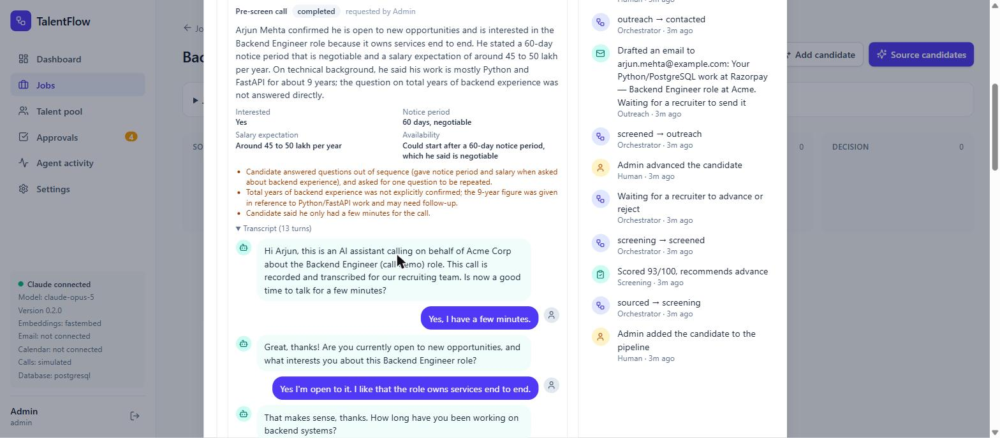
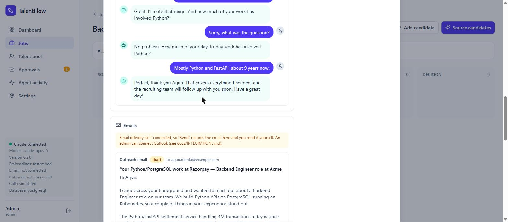

# TalentFlow

**An open-source, multi-agent recruiting pipeline powered by Claude.**

Seven specialist AI agents pick up applications from job portals, write job descriptions, and source, screen, contact, schedule, and evaluate candidates. An orchestrator moves each candidate through the pipeline, and a person makes every decision that matters: nobody advances past screening or gets an offer without a human approving it.


## Overview

**What it's for.** TalentFlow takes the repetitive work out of hiring without taking people out of the decisions. Recruiters spend hours reading resumes, writing outreach, and chasing interview times. TalentFlow's agents do that reading and writing in seconds, and explain every judgment with evidence from the resume, so your team can spend its time on the candidates who matter.

**How to use it.**
1. Upload resumes to the **talent pool**.
2. Create a **job** with a few specific requirements.
3. Click **Source candidates**. The agents find and screen the best matches.
4. Review each recommendation in **Approvals** and choose to advance or reject.
5. Send the drafted outreach email, or have the AI agent **call** the candidate for a quick pre-screen.
6. Book the interview. The agent can call to agree a time, and TalentFlow creates the Teams meeting and a reminder call.
7. After the interview, paste your notes to get a scorecard, then make the offer decision.

**New here?** Read the **[user guide](docs/USER_GUIDE.md)** for how the platform works and how to use every screen. To connect Outlook, Teams, and phone calls, see **[integrations](docs/INTEGRATIONS.md)**.

## Screenshots

| | |
|---|---|
|  **Dashboard.** Pipeline at a glance and a live feed of agent activity. |  **Approvals.** The review queue, strongest candidates first. Agents recommend; you decide. |
|  **Candidate review.** The agent's recommendation, the approval gate, and the full timeline. |  **Evidence-based screening.** Every requirement checked, with a quote from the resume. |
|  **Talent pool.** Upload PDF, DOCX, or TXT resumes; Claude parses the skills and experience. |  **Audit trail.** Every agent action and human decision, with who made it. |
|  **AI pre-screen call.** Interest, notice period, and salary pulled from the call, concerns flagged, full transcript kept. |  **Transcript and outreach.** The agent handles "sorry, what was the question?", and the personalized email waits for **Send**. |

_All screenshots show demo data from `python -m app.seed`, screened by Claude Opus 5._

## Architecture


## Features

- **Job portal intake.** Applications that Naukri, LinkedIn, Indeed, and other portals email to your recruiting inbox are imported automatically. The intake agent skips alerts and newsletters, parses the resume, recognizes returning applicants by email, adds each one to the right job, and starts screening. Careers pages and tools like Zapier can also push applications to a webhook. See [integrations](docs/INTEGRATIONS.md#job-portal-intake-resumes-from-naukri-linkedin-indeed-and-others).
- **AI job descriptions.** Type a few words, like "senior Python dev, 5 yrs, fintech, Bangalore", and the job-writer agent drafts the title, description, and screenable requirements for you to review.
- **Hybrid sourcing over whole resumes.** Every resume is split into pieces (a profile summary, each section, each job) and embedded, so skills on page three count as much as page one. Search combines meaning ("built RAG pipelines" matches "LLM applications") with exact keywords ("Kafka", "SAP FICO"), using pgvector HNSW and Postgres full-text indexes. Each match records the keywords found and the passage that matched.
- **Rich resume parsing.** Work history with dates, education, certifications, projects, and links, plus experience computed from the job dates. The original PDF or DOCX is kept for download (local disk, or S3 / Cloudflare R2).
- **Evidence-based screening.** Each requirement is marked met, partial, or not met, with a quote from the resume. The agent is instructed to ignore protected characteristics.
- **Personalized outreach.** Emails reference what actually makes the candidate a fit. Recruiters edit them and click **Send**, and they go out from **Outlook**.
- **Real scheduling.** Proposed slots avoid interviewers' busy times, and the interview is booked in Outlook with a **Teams meeting**. Invitations are sent automatically.
- **AI calling agent.** Pre-screen calls, scheduling calls that book the slot the candidate picks, and interview reminders over real phone calls through **Twilio**. The agent discloses that it's an AI, asks for consent, honors "don't call me", and saves a transcript and summary. You can try it in the app with simulated calls before connecting a phone number.
- **Structured scorecards.** Interview notes become per-competency ratings, a hire recommendation, and risks to probe.
- **Human approval gates.** A person decides to advance or reject after screening, and to offer or reject after evaluation.
- **Full audit trail.** Every agent action and human decision is written to an append-only event log, with who made it.
- **Built for production.**
  - Sign-in with admin and recruiter roles.
  - A durable agent task queue with retries and crash recovery.
  - Alembic migrations, security headers, rate-limited login, and JSON logs.
  - One-command AWS deployment with HTTPS and nightly backups.
- **Runs anywhere.** One `docker compose up` runs everything. With no API key it runs in an offline demo mode.

## Quick start

### Docker (recommended)

```bash
git clone https://github.com/<you>/talentflow.git
cd talentflow
cp .env.example .env          # set ADMIN_EMAIL / ADMIN_PASSWORD, and ANTHROPIC_API_KEY (optional)
docker compose up --build
```

Open **http://localhost:8000** and sign in with the admin credentials from `.env`. To load demo jobs and candidates:

```bash
docker compose exec app python -m app.seed
```

### Local development

You need Python 3.11+ and Node 20+. The backend uses SQLite by default, so no database server is required.

```bash
# Backend: http://localhost:8000, API docs at /docs
cd backend
python -m venv .venv
source .venv/bin/activate          # Windows: .venv\Scripts\activate
pip install -r requirements-dev.txt
cp ../.env.example ../.env         # set ADMIN_EMAIL / ADMIN_PASSWORD
python -m app.seed                 # optional demo data
uvicorn app.main:app --reload      # also runs the agent worker in-process in development

# Frontend: http://localhost:5173 (proxies /api to the backend)
cd frontend
npm install
npm run dev
```

## How it works

| Agent | Does | Output |
|---|---|---|
| **Intake** | Reads applications emailed by job portals (or pushed to the webhook), skips non-applications, and matches each one to an open job | Candidates added to the right pipeline |
| **Job writer** | Expands a recruiter's few-word brief into a full job posting | Title, description, requirements (a draft to review) |
| **Sourcing** | Writes an "ideal candidate" profile for the job, embeds it, and runs a vector search over the talent pool | Ranked matches |
| **Screening** | Scores the resume against each requirement | Score 0–100, met/partial/not-met with evidence, recommendation |
| **Outreach** | Drafts a personalized first-contact email | Subject and body |
| **Scheduling** | Proposes slots and writes the invitation | Slots and invite email |
| **Evaluation** | Turns interviewer notes into a scorecard | Competency ratings, recommendation, risks |

The **orchestrator** (`backend/app/orchestrator.py`) is an explicit state machine. Agents return typed results and never change a candidate's stage themselves. Every transition is validated and logged:

```
sourced → screening → screened ──[human: advance]──→ outreach → contacted
contacted ──[candidate replied]──→ scheduling → interview_scheduled
interview_scheduled ──[notes submitted]──→ evaluation → evaluated ──[human: offer]──→ offer
any open stage ──[human]──→ rejected
```

Agent work runs on a **durable task queue** (`backend/app/worker.py`). The task row is written in the same transaction as the stage change that needs it, so a crash or deploy never loses work. Workers claim tasks with `SELECT … FOR UPDATE SKIP LOCKED`, so you can run as many as you like. Rate limits, network errors, and API 5xx errors are retried with exponential backoff. Other errors fail fast and show a **Retry** button.

Each agent is a single Claude call with structured outputs: the response is validated against a Pydantic schema, so the UI never has to parse free text.

## Deploying to production

See **[docs/DEPLOYMENT.md](docs/DEPLOYMENT.md)**.

- **Infrastructure:** Terraform creates an EC2 instance, backups to S3, and logs in CloudWatch.
- **Deploy:** `deploy/deploy.sh` ships the app behind Caddy, which handles HTTPS automatically.
- **Verify:** `scripts/smoke_test.py` runs the whole pipeline against the live server.

It costs about $17/month on a t3.small.

## Configuration

Set these in `.env` (or `deploy/.env.production`). See [`.env.example`](.env.example) for the full list.

| Variable | Default | Notes |
|---|---|---|
| `ANTHROPIC_API_KEY` | — | Without it, agents use offline heuristics (demo mode) |
| `DEFAULT_MODEL` | `claude-opus-5` | Model for every agent |
| `MODEL_<AGENT>` | — | Per-agent override, e.g. `MODEL_SCHEDULING=claude-haiku-4-5` |
| `LLM_EFFORT` | `high` | `low` / `medium` / `high` / `xhigh` / `max`; lower is cheaper |
| `ADMIN_EMAIL` / `ADMIN_PASSWORD` | — | First admin, created when there are no users |
| `SECRET_KEY` | random per start (dev) | Signs sessions; **required** in production |
| `ENVIRONMENT` | `development` | `production` requires Postgres and a secret key, and turns off `/docs` |
| `DATABASE_URL` | SQLite file | Compose sets Postgres + pgvector automatically |
| `EMBEDDING_PROVIDER` | `fastembed` | `fastembed` (local, free) or `voyage` (hosted) |
| `COMPANY_NAME` | `Acme Corp` | Used in outreach and invitations |
| `TIMEZONE` | `UTC` | Interview hours are proposed in this timezone |

### Cost

A candidate who goes all the way through the pipeline costs roughly **$0.15–$0.40** on Claude Opus 5 at `LLM_EFFORT=high`. That covers six agent calls, mostly spent on output and thinking tokens. To cut costs, lower `LLM_EFFORT` or move simpler agents to `claude-sonnet-5` or `claude-haiku-4-5` with `MODEL_<AGENT>`. Embeddings run locally and cost nothing.

### Search: embeddings and indexes

Records and vectors live in one Postgres database with pgvector: candidates, jobs, and the pipeline are saved in the same transaction as their vectors, so they never drift apart. Anthropic doesn't offer an embedding model, so TalentFlow supports two:

| | **fastembed** (default) | **Voyage AI** |
|---|---|---|
| Where it runs | Locally on the CPU; resume text stays on your server | Hosted API (Anthropic's recommended embedding provider) |
| Setup | Nothing: `BAAI/bge-small-en-v1.5` is baked into the Docker image | `EMBEDDING_PROVIDER=voyage`, `EMBEDDING_MODEL=voyage-3.5`, `EMBEDDING_DIM=1024`, `VOYAGE_API_KEY` |
| Quality | Good. For better local results try `BAAI/bge-base-en-v1.5` with `EMBEDDING_DIM=768` | Best, and reads much longer inputs |
| Cost | Free | Low per resume; see Voyage's pricing |

Resumes are embedded in pieces of about 1,500 characters (`EMBEDDING_CHUNK_CHARS`), so every model sees the whole resume. Sourcing ranks candidates by their best-matching piece and by keyword matches, combined with reciprocal rank fusion. On Postgres, an HNSW index keeps vector search fast at millions of pieces, and a GIN full-text index serves the keywords.

**Changing the embedding model** (provider, model, or dimension): set the new values, deploy, then run once:

```bash
docker compose exec app python -m app.reembed        # or, without Docker: python -m app.reembed
```

It resizes the vector columns if `EMBEDDING_DIM` changed, rebuilds the indexes, and re-embeds every candidate and job without any LLM calls. Until it runs, the server log warns that the stored vectors don't match the model. If the configured provider's package isn't installed, TalentFlow reports an error instead of silently falling back to lower-quality vectors.

### Original resume files

Uploaded and job-portal resumes are kept so recruiters can download the original.

- **local** (default): files go to `STORAGE_DIR`. Docker Compose mounts the `files` volume at `/data/files`, and the AWS setup backs it up nightly with the database.
- **s3**: any S3-compatible bucket (AWS S3, Cloudflare R2, MinIO). Set `STORAGE_PROVIDER=s3` and `S3_BUCKET`; for R2 also `S3_ENDPOINT_URL=https://<account-id>.r2.cloudflarestorage.com` and `S3_REGION=auto`, plus `S3_ACCESS_KEY_ID` and `S3_SECRET_ACCESS_KEY`. Downloads use 5-minute presigned links, so the bucket stays private.
- **none**: keep only the extracted text.

### Hosted Postgres

Any Postgres with the `vector` extension works, including Supabase, Neon, and AWS RDS. Point `DATABASE_URL` at it with the `postgresql+psycopg://` scheme. Migrations create the extension and tables.

## API

Interactive docs are at `http://localhost:8000/docs` in development. Every endpoint except health and sign-in requires a session. Browsers use an httpOnly cookie; API clients can send `Authorization: Bearer <token>` using the token that sign-in returns.

```
POST /api/auth/login                    sign in
POST /api/jobs/draft                    job-writer agent: a few words → draft job posting
POST /api/jobs                          create a job
POST /api/jobs/{id}/source              queue the sourcing agent (auto-screens matches) → task
GET  /api/tasks/{id}                    poll a queued agent task
POST /api/candidates/upload             upload a PDF/DOCX/TXT resume
GET  /api/candidates/{id}/resume        download the original file
POST /api/intake/check                  queue a job-portal mailbox check → task
GET  /api/intake/items                  applications picked up from job portals
POST /api/intake/webhook                push an application (X-Intake-Token; public)
GET  /api/approvals?status=pending      the human review queue
POST /api/approvals/{id}/decide         approve or reject
POST /api/applications/{id}/replied     candidate replied → scheduling agent
POST /api/applications/{id}/notes       interview notes → evaluation agent
GET  /api/events                        the shared event log
GET  /api/health, /api/ready            liveness and readiness (public)
```

## Tests

```bash
cd backend
pytest                                               # SQLite, offline agents
TEST_DATABASE_URL=postgresql+psycopg://... pytest    # against Postgres + pgvector
python ../scripts/smoke_test.py http://<server>      # end-to-end against a live deployment
```

CI runs the test suite on SQLite and Postgres, plus the frontend build and the Docker build.

## Responsible use

Hiring decisions affect people's lives. TalentFlow is designed so that AI **assists** and humans **decide**:

- Agents are told to evaluate only job-relevant evidence and to ignore protected characteristics.
- Every screening judgment cites evidence from the resume, so reviewers can check it.
- Advancing a candidate and making an offer both require an explicit human approval, which is logged with the reviewer's name.

Before using AI screening in production, check the rules where you hire. Examples include NYC Local Law 144, the EU AI Act, and the Illinois AI Video Interview Act. Audit your outcomes for adverse impact.

## Roadmap

- [x] Outlook email, Outlook calendar, and Teams meetings
- [x] AI calling agent: pre-screen, scheduling, and reminders (Twilio)
- [ ] Ingest candidate email replies automatically
- [ ] Google Workspace (Gmail, Calendar, Meet)
- [ ] SSO (Google or Microsoft)
- [ ] Import candidates from LinkedIn, Greenhouse, or Lever
- [ ] Adverse-impact reporting dashboard
- [ ] Per-call token and cost tracking

## Contributing

PRs are welcome. See [CONTRIBUTING.md](CONTRIBUTING.md).

## License

[MIT](LICENSE)
